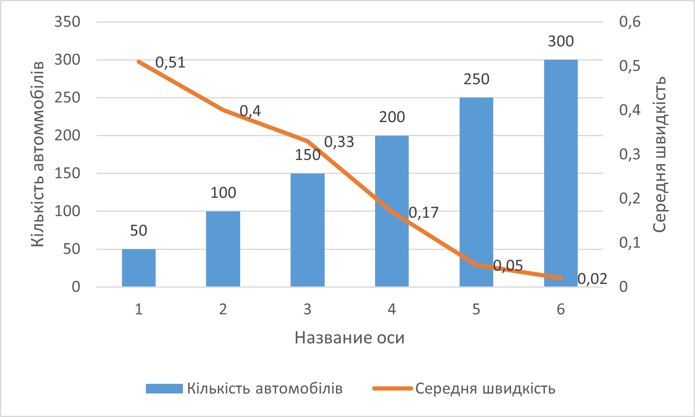
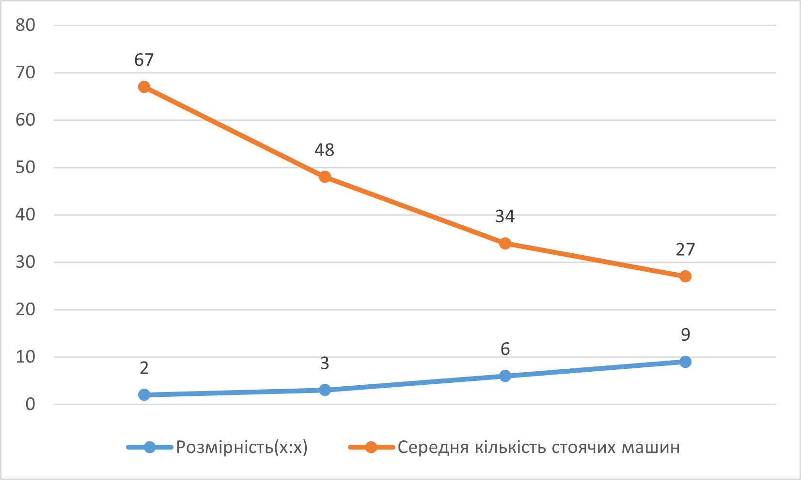
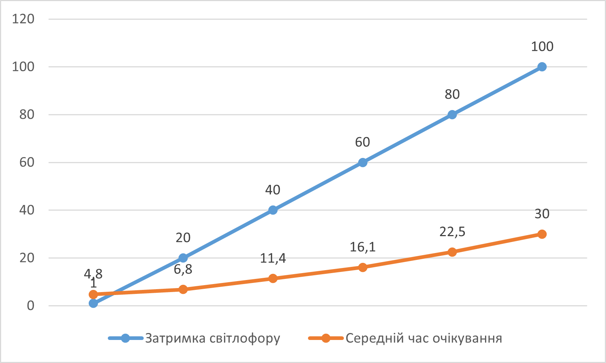

## Комп'ютерні системи імітаційного моделювання
## СПм-23-4, **Пахомова Євгенія Володимирівна**
### Лабораторна робота №**1**. Опис імітаційних моделей та проведення обчислювальних експериментів

 

### Варіант 1, модель у середовищі NetLogo Traffic Grid:
[Traffic Grid](http://www.netlogoweb.org/launch#http://www.netlogoweb.org/assets/modelslib/Sample%20Models/Social%20Science/Traffic%20Grid.nlogo)

 

### Вербальний опис моделі:
Це модель руху транспорту в міській сітці. Це дозволяє вам керувати світлофорами та глобальними змінними, такими як обмеження швидкості та кількість автомобілів, а також досліджувати динаміку руху. Кожного кроку машини намагаються рухатися вперед із поточною швидкістю. Якщо їхня поточна швидкість менша за обмеження швидкості і прямо перед ними немає автомобіля, вони прискорюються. Якщо попереду є повільніша машина, вони зрівняються зі швидкістю повільнішої машини та сповільнюються. Якщо перед ними червоне світло або зупинилася машина, вони зупиняються.

Є два різні способи зміни освітлення. По-перше, користувач може змінити будь-яке світло в будь-який час, зробивши його поточним, а потім натиснувши «CHANGE LIGHT». По-друге, світло може змінюватися автоматично один раз за цикл. Спочатку всі індикатори автоматично змінюватимуться на початку кожного циклу.

### Керуючі параметри:
- **grid-size-x** - Кількість вертикальних доріг.
- **grid-size-y** - Кількість горизонтальних доріг.
- **num-cars** - Кількість машин.
- **power?** - Режим роботи з світлофорами(Так/Ні).
- **ticks-per-cycle** - Кількість тактів до наступної зміни кольору світлофору.
- **speed-limit** - Максимальна швидкість автомобілю.
- **current-auto?** - перемикає поточне освітлення між автоматичним режимом, де воно змінюється один раз за цикл(Так/Ні).
- **current-phase** - контролює, коли поточне світло змінюється, якщо воно знаходиться в автоматичному режимі.

### Показники роботи системи:
- **Stopped Cars** - відображає графік кількість зупинених автомобілів протягом симуляції.
- **Average Speed of Cars** - відображає середню швидкість автомобілів протягом симуляції.
- **Average Wait Time of Cars** - відображає середній час зупинки та очікування автомобілів протягом симуляції.

### Примітки:
- У правому нижньому куті майже завжди є пробка.
- У водіїв не виникає бажання повернути наліво/направо.

### Недоліки моделі:
- Машини часто зупиняються занадто швидко безпосередньо перед машиною попереду.
- Іноді навіть врізаються у передню машину.
- Машини зупиняються безпосередньо на світлофорі, а не до нього.

 

## Обчислювальні експерименти
### 1. Вплив завантаженості дороги на середню швидкість переміщення нею
Досліджується залежність середньої швидкості машин протягом певної кількості тактів (200) від числа машин у симуляції, зазначеного на початку симуляції.
Експерименти проводяться при 50-300 машинах, з кроком 50, усього 6 симуляцій.  
Інші керуючі параметри мають значення за замовчуванням:
- **grid-size-x** - 5
- **grid-size-y** - 5
- **power?** - Так
- **ticks-per-cycle** - 20
- **speed-limit** - 1
- **current-auto?** - Так
- **current-phase** - 0

<table>
<thead>
<tr><th>Кількість автомобілів</th><th>Середня швидкість</th></tr>
</thead>
<tbody>
<tr><td>50</td><td>0,51</td></tr>
<tr><td>100</td><td>0,4</td></tr>
<tr><td>150</td><td>0,33</td></tr>
<tr><td>200</td><td>0,17</td></tr>
<tr><td>250</td><td>0,05</td></tr>
<tr><td>300</td><td>0,02</td></tr>
</tbody>
</table>

Графік наочно показує, що чим більше машин буде на трасі тим менше буде їх середня швидкість.

Під час проведення експерименту при значенні кількості машин 250 та вище машини майже не рухалися.

 

### 2. Вплив кількості доріг на середню кількість машин, що стоять
Досліджується залежність середньої кількості машин, що стоять протягом певної кількості тактів (200) від розмірності сітки доріг.
Експерименти проводяться при 2х2 - 9х9 розмірності сітки, усього 4 симуляції.  
Інші керуючі параметри мають значення за замовчуванням:
- **num-cars** - 10
- **power?** - Так.
- **ticks-per-cycle** - 20
- **speed-limit** - 1
- **current-auto?** - Так.
- **current-phase** - 0

<table>
<thead>
<tr><th>Розмірність(х:х)</th><th>Середня кількість стоячих машин</th></tr>
</thead>
<tbody>
<tr><td>2</td><td>67</td></tr>
<tr><td>3</td><td>48</td></tr>
<tr><td>6</td><td>34</td></tr>
<tr><td>9</td><td>27</td></tr>
</tbody>
</table>

Як видно з результатів експерименту - збільшення кількості доріг сприятливо впливає на зниження кількості стоячих машин.

 

### 3. Вплив затримки світлофору на середній час очікування
Досліджується залежність середнього часу очікування руху машинами від затримки світлофору протягом певної кількості тактів (200).
Експерименти проводяться від 1 до 100 одиниць затримки, з кроком 20, усього 6 симуляції.  
Інші керуючі параметри мають значення за замовчуванням:
- **grid-size-x** - 5
- **grid-size-y** - 5
- **num-cars** - 150
- **power?** - Так.
- **speed-limit** - 1
- **current-auto?** - Так.
- **current-phase** - 0

<table>
<thead>
<tr><th>Затримка світлофору</th><th>Середній час очікування</th></tr>
</thead>
<tbody>
<tr><td>1</td><td>4.8</td></tr>
<tr><td>20</td><td>6.8</td></tr>
<tr><td>40</td><td>11.4</td></tr>
<tr><td>60</td><td>16.1</td></tr>
<tr><td>80</td><td>22.5</td></tr>
<tr><td>100</td><td>30</td></tr>
</tbody>
</table>

Під час проведення експерименту найкращій результат був отриманий при затримці в 1 одиницю. Але на практиці світлофор мігав у режимі "стробоскоп", що не відповідає реальним умовам роботи.
