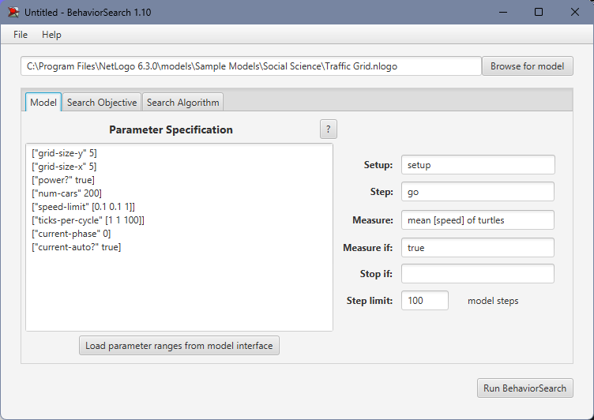
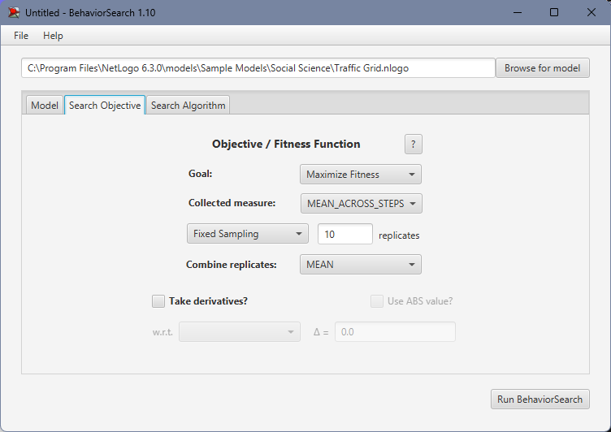
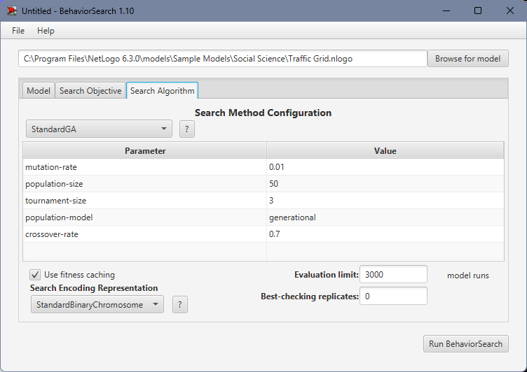
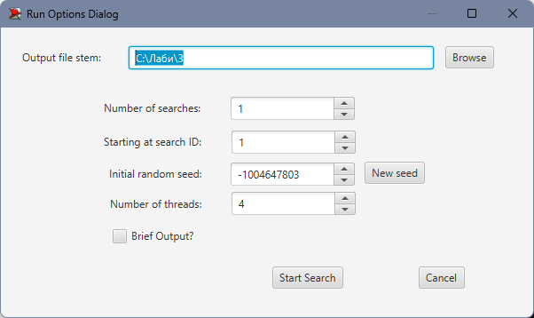
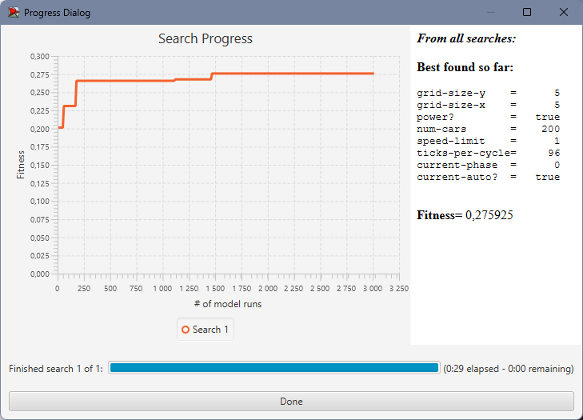
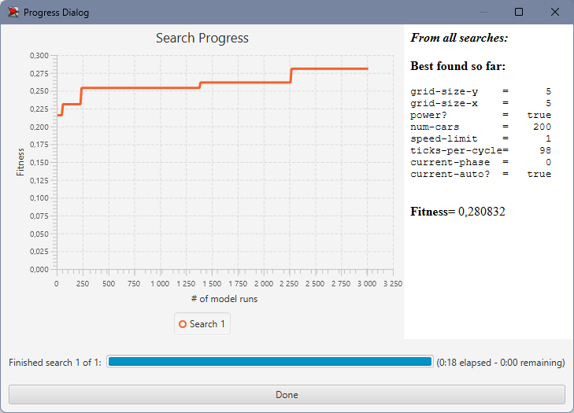

## Комп'ютерні системи імітаційного моделювання
## СПм-22-6, **Афанасьєва Анна Миколаївна**
### Лабораторна робота №**3**. Використання засобів обчислювального интелекту для оптимізації імітаційних моделей

 

### Варіант 1, модель у середовищі NetLogo Traffic Grid:
[Traffic Grid](http://www.netlogoweb.org/launch#http://www.netlogoweb.org/assets/modelslib/Sample%20Models/Social%20Science/Traffic%20Grid.nlogo)

 

### Вербальний опис моделі:
Це модель руху транспорту в міській сітці. Це дозволяє вам керувати світлофорами та глобальними змінними, такими як обмеження швидкості та кількість автомобілів, а також досліджувати динаміку руху. Кожного кроку машини намагаються рухатися вперед із поточною швидкістю. Якщо їхня поточна швидкість менша за обмеження швидкості і прямо перед ними немає автомобіля, вони прискорюються. Якщо попереду є повільніша машина, вони зрівняються зі швидкістю повільнішої машини та сповільнюються. Якщо перед ними червоне світло або зупинилася машина, вони зупиняються.

Є два різні способи зміни освітлення. По-перше, користувач може змінити будь-яке світло в будь-який час, зробивши його поточним, а потім натиснувши «CHANGE LIGHT». По-друге, світло може змінюватися автоматично один раз за цикл. Спочатку всі індикатори автоматично змінюватимуться на початку кожного циклу.

### Керуючі параметри:
- **grid-size-x** - Кількість вертикальних доріг.
- **grid-size-y** - Кількість горизонтальних доріг.
- **num-cars** - Кількість машин.
- **power?** - Режим роботи з світлофорами(Так/Ні).
- **ticks-per-cycle** - Кількість тактів до наступної зміни кольору світлофору.
- **speed-limit** - Максимальна швидкість автомобілю.
- **current-auto?** - перемикає поточне освітлення між автоматичним режимом, де воно змінюється один раз за цикл(Так/Ні).
- **current-phase** - контролює, коли поточне світло змінюється, якщо воно знаходиться в автоматичному режимі.

### Показники роботи системи:
- **Stopped Cars** - відображає графік кількість зупинених автомобілів протягом симуляції.
- **Average Speed of Cars** - відображає середню швидкість автомобілів протягом симуляції.
- **Average Wait Time of Cars** - відображає середній час зупинки та очікування автомобілів протягом симуляції.

 

### Налаштування середовища BehaviorSearch:

**Обрана модель**:
<pre>
C:\Program Files\NetLogo 6.3.0\models\Sample Models\Social Science\Traffic Grid.nlogo
</pre>
**Параметри моделі** (вкладка Model):  
*Параметри та їх можливі діапазони були **автоматично** вилучені середовищем BehaviorSearch із вибраної імітаційної моделі, для цього є кнопка «Завантажити діапазони параметрів із інтерфейсу моделі»*:
<pre>
["grid-size-y" [1 1 9]]
["grid-size-x" [1 1 9]]
["power?" true false]
["num-cars" [1 1 400]]
["speed-limit" [0.1 0.1 1]]
["ticks-per-cycle" [1 1 100]]
["current-phase" [0 1 99]]
["current-auto?" true false]
</pre>
*Кількість машин було знижено мною, в порівнянні зі значенням за замовчуванням, для скорочення часу симуляції, оскільки налаштування цієї моделі демонструвалося на лекції і був сенс не затягувати необхідний для аналізу час.*  
Використовувана **міра**:  
Для фітнес-функції *(вона ж функція пристосованості або цільова функція)* було обрано **значення середньої швидкості всіх машин на дорогах**, вираз для її розрахунку взято з налаштувань графіка аналізованої імітаційної моделі в середовищі NetLogo

та вказано у параметрі "**Measure**":
<pre>
mean [ speed ] of turtles
</pre>
Середня швидкість всіх машин на трасі повинна враховуватися **в середньому** за весь період симуляції тривалістю, *для приклада*, 500 тактів (адже на кожному такті є своє значення поточної середньої швидкості усіх учасників дорожного руху), починаючи з 0 такту симуляції.
Параметр зупинки за умовою ("**Stop if**") у разі не використовувався.  
Загальний вигляд вкладки налаштувань параметрів моделі:

**Налаштування цільової функції** (вкладка Search Objective):  
Метою підбору параметрів імітаційної моделі, що описує дорожній рух, є **максимізація** значення середньої швидкості машин на трасі – це вказано через параметр "**Goal**" зі значенням **Maximize Fitness**. Тобто необхідно визначити такі параметри налаштувань моделі, у яких машини рухаються з максимальною швидкістю. При цьому цікавить не просто середня швидкість всіх машин у якийсь окремий момент симуляції, а середнє її значення за всю симуляцію (тривалість якої (500 кроків) вказувалася на минулій вкладці). Для цього у параметрі "**Collected measure**", що визначає спосіб обліку значень обраного показника, вказано **MEAN_ACROSS_STEPS**.  
Щоб уникнути викривлення результатів через випадкові значення, що використовуються в логіці самої імітаційної моделі, **кожна симуляція повторюється по 10 разів**, результуюче значення розраховується як **середнє арифметичне**.
Загальний вигляд вкладки налаштувань цільової функції:

**Налаштування алгоритму пошуку** (вкладка Search Algorithm):  
Загальний вид вкладки налаштувань алгоритму пошуку:

 

### Результати використання BehaviorSearch:
Діалогове вікно запуску пошуку *(можна залишити за замовчуванням, але стежте, куди пишеться результат)*:

Результат пошуку параметрів імітаційної моделі, використовуючи **генетичний алгоритм**:

Результат пошуку параметрів імітаційної моделі, використовуючи **випадковий пошук**:

